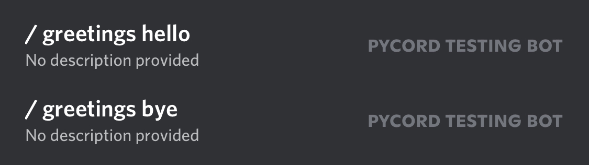

import {
  DiscordButton,
  DiscordButtons,
  DiscordInteraction,
  DiscordMessage,
  DiscordMessages,
} from "discord-message-components/packages/react";
import "discord-message-components/packages/react/dist/style.css";

import DiscordComponent from "../../../src/components/DiscordComponent";

import Tabs from "@theme/Tabs";
import TabItem from "@theme/TabItem";


On March 24, 2021, Discord added Slash Commands to Discord as an easier, more efficient, and better way of using bot commands. Pycord has implemented Slash Commands into the library so it's simple, efficient, and familiar.

## Syntax

Let's create a simple Slash Command.

```py
import discord

bot = discord.Bot(debug_guilds=[...]) # specify the guild IDs in debug_guilds

# since global slash commands can take up to an hour to register,
# we need to limit the guilds for testing purposes

@bot.command(description="Sends the bot's latency.") # this decorator makes a slash command
async def ping(ctx): # a slash command will be created with the name "ping"
    await ctx.respond(f"Pong! Latency is {bot.latency}")

bot.run("TOKEN")
```

<DiscordComponent>
  <DiscordMessage profile="robocord">
    <div slot="interactions">
      <DiscordInteraction profile="bob" command>
        ping
      </DiscordInteraction>
    </div>
    Pong! Latency is 335ms.
  </DiscordMessage>
</DiscordComponent>

<br />

Let's go through the code.

First, we import Pycord's `discord` package.

Next, we create a [`discord.Bot`](https://docs.pycord.dev/en/master/api.html#discord.Bot) object and assign it to a variable `bot`. Notice how we pass the parameter [`debug_guilds`](https://docs.pycord.dev/en/master/api.html#discord.Bot.debug_guilds). Global Slash Commands take up to an hour to register, however, if we limit our bot commands to a few specific guilds, we can use them instantly on those guilds. This is useful for testing purposes. Once you have polished up your command and made it all shiny, you can share its shininess with all of the bot's servers by removing this parameter.

We then go ahead and use the [`@bot.command`](https://docs.pycord.dev/en/master/api.html#discord.Bot.command) decorator, which registers a new Slash Command. We pass a `description` parameter to give a description to the Slash Command. We can also pass a `name` parameter to change the Slash Command's name. By default, the name of the Slash Command will be the name of the function, in this case, `/ping`.

We create an async function called `ping` with parameters `ctx`, which, when called, sends the bot's ping/latency using [`ctx.respond`](https://docs.pycord.dev/en/master/api.html#discord.ApplicationContext.respond).

## Subcommand Groups

You might want to group certain commands together to make them more organised. You could use a cog, but sometimes a better solution is to make a Command Group. A Command Group is exactly what it sounds like, a group of individual slash commands together.

In order to make a slash command group, you can either use the `bot.create_group` function or manually make a `SlashCommandGroup` class like this:

```python
import discord

bot = discord.Bot(debug_guilds=[...]) # specify the guild IDs in debug_guilds

# create slash command group with bot.create_group
greetings = bot.create_group("greetings", "Greet people")

@greetings.command()
async def hello(ctx):
  await ctx.respond(f"Hello, {ctx.author}!")

@greetings.command()
async def bye(ctx):
  await ctx.respond(f"Bye, {ctx.author}!")

# or create a slash command group manually
math = SlashCommandGroup("math", "Math related commands")

@math.command()
async def add(ctx, num1: int, num2: int):
  sum = num1 + num2
  await ctx.respond(f"{num1} plus {num2} is {sum}.")

@math.command()
async def subtract(ctx, num1: int, num2: int):
  sum = num1 - num2
  await ctx.respond(f"{num1} minus {num2} is {sum}.")

# you'll have to manually add the manually created slash command group
bot.add_application_command(math)

bot.run("TOKEN")
```

Here's what the registered subcommands will look like in the Slash Command Menu:



You'll notice that there's the name of the Slash Command Group and then the name of the subcommand separated by a space.

## Sub-groups

We've made a subcommand group, but did you know that you could create a group inside another?

```python
from discord import SlashCommandGroup
from math import sqrt

math = SlashCommandGroup("math", "Math related commands")
advanced = math.create_subgroup("advanced", "Advanced math commands")

@advanced.command()
async def square_root(ctx, x: int):
    await ctx.respond(sqrt(x))

bot.add_application_command(math)
```

The command created above can be invoked by typing `/math advanced square_root`.

## Slash Commands in Cogs

As seen with the [commands extension](../../extensions/commands/cogs), cogs are a useful feature to group commands together. Fortunately, cogs can also work with Slash Commands!

In order to use Slash Commands with cogs, you'll have to use the `slash_command` decorator instead of the `bot.command` decorator. This is imported with the `discord` module, so you don't have to import anything else.

Here's a cog with slash commands instead of prefix commands.

```python title="./cogs/greetings.py"
import discord
from discord.ext import commands

class Greetings(commands.Cog):
    def __init__(self, bot):
        self.bot = bot

    @discord.slash_command()
    async def hello(self, ctx):
        await ctx.respond("Hello, this is a slash command from a cog!")

    @discord.slash_command()
    async def bye(self, ctx):
        await ctx.respond("Bye, remember that this is a slash command from a cog!")

    @discord.slash_command(guild_ids=[...])
    async def restricted(self, ctx):
        await ctx.respond("Hi, this is a restricted slash command from a cog!")

def setup(bot):
    bot.add_cog(Greetings(bot))
```

The registered slash commands from the cog should be displayed as normal in the Slash Command menu.

<DiscordComponent>
  <DiscordMessage profile="robocord">
    <div slot="interactions">
      <DiscordInteraction profile="bob" command>
        hello
      </DiscordInteraction>
    </div>
    Hello, this is a slash command from a cog!
  </DiscordMessage>
</DiscordComponent>

## Options & Option Types

Whenever you're using Slash Commands, you might notice that you can specify parameters that the user has to set or can optionally set. These are called Options.

Since you want different inputs from Options, you'll have to specify the type for that Option. There are a few ways of doing this.

<Tabs>
  <TabItem value="0" label="Using Type Annotations" default>

You could use Type Annotations and let Pycord figure out the option type, like shown below.

```python
import discord

bot = discord.Bot()

@bot.command()
# pycord will figure out the types for you
async def add(ctx, first: discord.Option(int), second: discord.Option(int)):
  # you can use them as they were actual integers
  sum = first + second
  await ctx.respond(f"The sum of {first} and {second} is {sum}.")

bot.run("TOKEN")
```

<DiscordComponent>
  <DiscordMessage profile="robocord">
    <div slot="interactions">
      <DiscordInteraction profile="bob" command>
        add
      </DiscordInteraction>
    </div>
    The sum of 1 and 1 is 2.
  </DiscordMessage>
</DiscordComponent>

  </TabItem>
  <TabItem value="1" label="Using the SlashCommandOptionType enum">

You could also explicitly declare the type using the [`SlashCommandOptionType`](https://docs.pycord.dev/en/master/api.html#discord.SlashCommandOptionType) enum.

```python title="Slash Command Type"
import discord

bot = discord.Bot()

@bot.command()
# this explicitly tells pycord what types the options are instead of it figuring it out by itself
async def join(
  ctx,
  first: discord.Option(discord.SlashCommandOptionType.string),
  second: discord.Option(discord.SlashCommandOptionType.string)
):
  joined = first + second
  await ctx.respond(f"When you join \"{first}\" and \"{second}\", you get: \"{joined}\".")

bot.run("TOKEN")
```

<DiscordComponent>
  <DiscordMessage profile="robocord">
    <div slot="interactions">
      <DiscordInteraction profile="bob" command>
        join
      </DiscordInteraction>
    </div>
    When you join "Hello" and "World!", you get: "Hello World!"
  </DiscordMessage>
</DiscordComponent>

  </TabItem>
</Tabs>

:::info Related Topics

- [Interactions Index](../../interactions)
- [Rules and Common Practices](../../getting-started/rules-and-common-practices)

:::