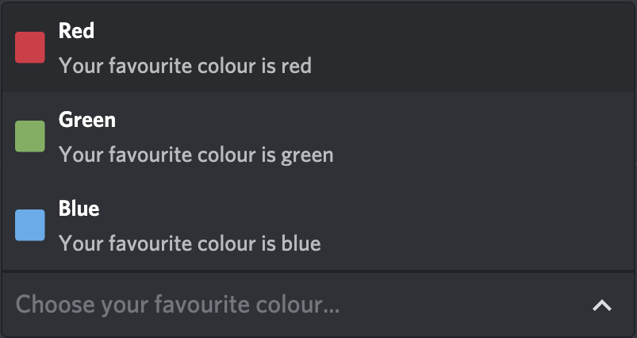
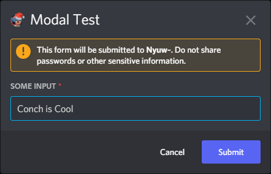

import {
    DiscordButton,
    DiscordButtons,
    DiscordInteraction,
    DiscordMessage,
    DiscordMessages,
} from "discord-message-components/packages/react";
import "discord-message-components/packages/react/dist/style.css";

import DiscordComponent, { defaultOptions } from "../../src/components/DiscordComponent";

In December 2020, Discord released their first Interaction: the
[Slash Command](https://discord.com/developers/docs/interactions/application-commands#slash-commands).
Since then, Discord has added many types of Interactions, including:

[**Application Commands**](https://discord.com/developers/docs/interactions/application-commands)

-   [**Slash Commands**](https://discord.com/developers/docs/interactions/application-commands#slash-commands):
Commands that can be used with the `/` prefix.
-   **Context Menu Commands**: Commands that can be used from the right-click menu.
    -   [**User Commands**](https://discord.com/developers/docs/interactions/application-commands#user-commands):
   Commands that can be used on a user by alt-clicking/selecting them.
    -   [**Message Commands**](https://discord.com/developers/docs/interactions/application-commands#message-commands):
   Commands that can be used on a message by alt-clicking/selecting it.

[**UI Components**](https://discord.com/developers/docs/interactions/message-components)

-   [**Buttons**](https://discord.com/developers/docs/interactions/message-components#buttons):
Buttons are attached to a message and can be clicked on to perform an action.
-   [**Select Menus**](https://discord.com/developers/docs/interactions/message-components#select-menus):
Drop-down menus are used to select a number of options from a list.
-   [**Modals**](https://discord.com/developers/docs/interactions/message-components#text-inputs):
Form-like modals can be used to ask for input from a user.

## Application Commands

Application Commands are another set of new features that are intended to avoid compromising users' safety and privacy. 
They're relatively easy to add to your bot, and give people a simpler and safer way to use commands.

### [Slash Commands](https://docs.pycord.dev/en/stable/api.html#slashcommand)

Slash Commands were the first Interaction added to Discord. They're easy to use and create, and
is the only prefix commands alternative that does not need Message Content intent.

:::note

Preferring prefix commands over Application Commands is **not** a valid reason to apply for the
Message Content intent. Using that as a reason will get your application denied.

:::

<DiscordComponent>
  <DiscordMessage profile="robocord">
    

      <DiscordInteraction profile="bob" command>
        ping
      </DiscordInteraction>
    

    Pong! Latency is 335ms.
  </DiscordMessage>
</DiscordComponent>

 

This is what a Slash Command looks like. Not too different from a prefix command,
apart from the note telling you who invoked it. A Slash Command's fields can accept any of the following:

-   Members
-   Roles
-   Channels
-   Attachments
-   Text

Just about as good as it gets.

### [Message](https://docs.pycord.dev/en/stable/api.html#messagecommand) and [User](https://docs.pycord.dev/en/stable/api.html#usercommand) Commands

Message Commands and User Commands were both introduced at around the same time, and are very similar to each other, so we'll be 
introducing them together. These commands can be found in the `Apps` tab when alt-clicking. The only difference between the two is that 
Message Commands only appear in the `Apps` tab of a message, while User Commands are found in the `Apps` tab of a user. Message Commands 
can be used to quickly report a message, warn a user for a message, and other functions. Likewise, User Commands can be used to add a 
user to a ticket, warn a user, and more.

Here's an example of a Message Command:

<DiscordComponent>
  <DiscordMessage profile="bob">
    Hello World!
  </DiscordMessage>
  <DiscordMessage profile="robocord">
    

      <DiscordInteraction profile="dorukyum" contextMenu>
        Reverse Message
      </DiscordInteraction>
    

    Message 930650407917748286 reversed is "!dlroW olleH"
  </DiscordMessage>
</DiscordComponent>

 

And here's an example of a User Command:

<DiscordComponent>
  <DiscordMessage profile="bob">
    {defaultOptions.profiles.dorukyum.author} has been on Discord for a long time
  </DiscordMessage>
  <DiscordMessage profile="robocord">
    

      <DiscordInteraction profile="dorukyum" contextMenu>
        User Age
      </DiscordInteraction>
    

      {defaultOptions.profiles.dorukyum.author} is 1 week old.
  </DiscordMessage>
  <DiscordMessage profile="robocord">
    

      <DiscordInteraction profile="dorukyum" contextMenu>
        User Age
      </DiscordInteraction>
    

    {defaultOptions.profiles.bob.author} is 40 years old.
  </DiscordMessage>
  <DiscordMessage profile="dorukyum">
    🤔
  </DiscordMessage>
</DiscordComponent>

 

Pretty cool, right? To learn more about these two, please read the [Context Menus guide](./application-commands/context-menus.mdx).

## [Application Commands](#application-commands) vs. [Prefix Commands](../extensions/commands/prefixed-commands)

Ever since Discord was created, apps on it have used prefix commands. Using prefixes meant that you would have to put a
certain character (or string of characters) in front of your command, such as the exclamation mark in `!ping`. The way this
worked was that your bot would listen for messages, pick out the ones that had their specific prefix, and then respond to the command. 
Now, Discord is encouraging developers to switch their bots over to Application Commands, which is a new system meant to preserve the 
privacy and safety of their users. But why exactly is Discord making us switch? What's the better option, Application Commands or prefix 
commands? Below, we'll discuss everything you need to know.

### Discord's Decision

Application Commands were conceptualized partly due to privacy concerns. When Discord first began, they weren't entirely concerned about bots 
having access to the content of every message that was being sent. However, as Discord grew, this became more of a problem. Hypothetically, bots 
could simply log every message they're able to receive via the Discord API and hand their contents over to a company or other third party. This is 
a problem, since that data is meant to be used only by Discord. As such, they locked down Message Content, and introduced Application Commands for 
bot developers to use instead.

Prefix commands work by reading messages, as described before. Application Commands, however, don't
work this way; instead, they work by having your bot get information from Discord about when a command was used. This way, Discord can limit 
Message Content only to bots that _absolutely_ depend on it, such as auto-moderation bots.

### Who has to Use Application Commands

Any verified bot that does not have the Message Content intent must use Application Commands. Discord is allowing developers to submit 
applications for the ability to use the intent; however, since they don't want to keep supporting prefix commands due to privacy concerns, 
they will automatically decline any application that includes only that as a reason. So, if your bot doesn't have an auto-moderation feature 
(or any other functionality that requires Message Content), you're out of luck.

Unverified bots, however, don't have to use Application Commands. This is because the Message Content intent is a `Privileged Intent`, meaning that 
it must be applied for only if your bot is verified or about to be verified. Unverified bots don't have to apply for Privileged Intents, so they can 
use them freely.

So, if your bot is made only for a couple of servers, you can choose between prefix commands and Application Commands. However, if you plan on expanding
your bot's reach, it'll have to use Application Commands.

### What's the Better Option

Choosing which is the better option is up to you, if you're starting small. If
you plan on growing your bot, however, you will have to use Application Commands. Since prefix commands are slowly being phased out by Discord, 
there isn't much of a choice for developers of larger bots.

## Message Components

Message Components are fairly new features in Discord, allowing developers to give their bots a fast
and understandable user interface. Message Components are easy to use and make your bot look modern,
sleek, and downright awesome.

### [Views](https://docs.pycord.dev/en/stable/api.html#discord.ui.View)

Views are not an Application Command nor are they a Message Component. Views are the invisible placeholders, or grid, 
that Message Components lie in. Views can have up to 5 [`Action Rows`](https://docs.pycord.dev/en/stable/api.html#discord.ActionRow), 
and Action Rows can have a maximum of 5 slots. Below, you can find a table showing how many slots a Message Interaction takes up.

| Component    | Slots                        |
| ------------ | ---------------------------- |
| Buttons      | 1 Slot                       |
| Select Menus | 5 Slots                      |
| Text Modals  | 1 Slot (opened via a Button) |

So, based on this, you could have a maximum of 25 Buttons in a View with no Select Menus, and 5 Select
Menus in a View with no Buttons. This doesn't mean you can't have them both in a View, however. You can have
a combination of them, such as 20 Buttons and a Select Menu or 10 Buttons and 3 Select Menus.

### [Buttons](https://docs.pycord.dev/en/stable/api.html#discord.ui.Button)

Buttons are the first of the Message Components. They allow for quick responses to prompts, such as for canceling or continuing an action. 
Of course, these aren't their only uses; people have created awesome things with Buttons, such as calculators, games, and more!

<DiscordComponent>
  <DiscordMessage profile="robocord">
    Discord Buttons are awesome!
    

      <DiscordButtons>
        <DiscordButton type="primary" emoji="😎">Click me!</DiscordButton>
      </DiscordButtons>
    

  </DiscordMessage>
</DiscordComponent>

 

This is what a Button looks like, very simple and modern. To learn more about Buttons, refer to our
[Buttons page](./ui-components/buttons.mdx).

### [Select Menus](https://docs.pycord.dev/en/stable/api.html#discord.ui.Select)

Select Menus are the second of Discord's Message Components. They allow users to select from a list of choices, which your bot can then use. 
Select Menus are good for things such as choosing features, pages of a help menu, and more.

This is what a Select Menu looks like. While not looking as good as Buttons, they still look great
and have even greater possibilities. To learn more about Select Menus, please refer to our [Select
Menus page](./ui-components/dropdowns.mdx).

### [Modal Dialogs](https://docs.pycord.dev/en/stable/api.html#discord.ui.Modal)

Text Modals are the most recently added Message Component in Discord. They're useful for text input and filling out forms, such as a 
sign-up for your bot's service. These are meant to replace long bot setup processes by allowing users to fill out multiple text fields, 
which avoids having the user send multiple messages for the bot. Modals can be accessed by either invoking an Application Command or by
interacting with another UI Component.

This is what a Text Modal looks like, easy to use and one of the most useful Message Components yet. To learn more about Text Modals, 
please visit our [Modal Dialogs page](./ui-components/modal-dialogs.mdx).
