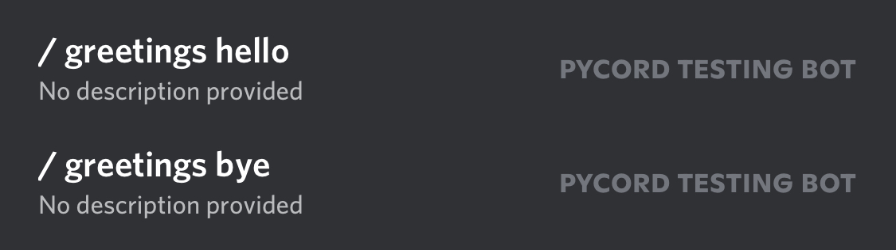

import {
  DiscordButton,
  DiscordButtons,
  DiscordInteraction,
  DiscordMessage,
  DiscordMessages,
} from "discord-message-components/packages/react";
import "discord-message-components/packages/react/dist/style.css";

import DiscordComponent from "@site/src/components/DiscordComponent";

import Tabs from "@theme/Tabs";
import TabItem from "@theme/TabItem";

On March 24, 2021, Discord added Slash Commands to Discord as an easier, more efficient, and better way of using bot commands. Pycord has implemented Slash Commands into the library, so it's simple, efficient, and familiar.

:::important

Remember that Slash Commands require your bot to be invited with the `application.commands` scope or Slash Commands will not show up. Bots already in the guild can simply be invited again with the scope; there is no need to kick the bot.

:::

## Syntax

Let's create a simple Slash Command.

```py
import discord

bot = discord.Bot()

# we need to limit the guilds for testing purposes
# so other users wouldn't see the command that we're testing

@bot.command(description="Sends the bot's latency.") # this decorator makes a slash command
async def ping(ctx): # a slash command will be created with the name "ping"
    await ctx.respond(f"Pong! Latency is {bot.latency}")

bot.run("TOKEN")
```

<DiscordComponent>
  <DiscordMessage profile="robocord">
    <div slot="interactions">
      <DiscordInteraction profile="bob" command>
        ping
      </DiscordInteraction>
    </div>
    Pong! Latency is 335ms.
  </DiscordMessage>
</DiscordComponent>

<br />

Let's go through the code.

First, we import Pycord's `discord` package.

Next, we create a [`discord.Bot`](https://docs.pycord.dev/en/stable/api/clients.html#discord.Bot) object and assign it to a variable `bot`.

We then go ahead and use the [`@bot.command`](https://docs.pycord.dev/en/stable/api/clients.html#discord.Bot.command) decorator, which registers a new Slash Command. We pass a `description` parameter to give a description to the Slash Command. We can also pass a `name` parameter to change the Slash Command's name. By default, the name of the Slash Command will be the name of the function, in this case, `/ping`.

We create an async function called `ping` with parameters `ctx`, which, when called, sends the bot's ping/latency using [`ctx.respond`](https://docs.pycord.dev/en/stable/api/application_commands.html#discord.ApplicationContext.respond).

## Subcommand Groups

You might want to group certain commands together to make them more organised. A command group is exactly what it sounds like, a group of individual Slash Commands together.

In order to make a Slash Command group, you can use the `bot.create_group` function.

```python
import discord

bot = discord.Bot()

# create Slash Command group with bot.create_group
greetings = bot.create_group("greetings", "Greet people")

@greetings.command()
async def hello(ctx):
  await ctx.respond(f"Hello, {ctx.author}!")

@greetings.command()
async def bye(ctx):
  await ctx.respond(f"Bye, {ctx.author}!")

bot.run("TOKEN")
```

Or, you can instead manually make a `SlashCommandGroup` class like so:

```python
import discord

math = discord.SlashCommandGroup("math", "Math related commands")

@math.command()
async def add(ctx, num1: int, num2: int):
  sum = num1 + num2
  await ctx.respond(f"{num1} plus {num2} is {sum}.")

@math.command()
async def subtract(ctx, num1: int, num2: int):
  sum = num1 - num2
  await ctx.respond(f"{num1} minus {num2} is {sum}.")

# you'll have to manually add the manually created Slash Command group
bot.add_application_command(math)
```

Here's what the registered subcommands will look like in the Slash Command Menu:



You'll notice that there's the name of the Slash Command Group and then the name of the subcommand separated by a space.

:::

:::info Cogs

If you are looking to add Slash Command Groups to cogs, please look at our [Cogs page](../../popular-topics/cogs)!

:::

## Sub-groups

We've made a subcommand group, but did you know that you could create a group inside another?

```python
from discord import SlashCommandGroup
from math import sqrt

math = SlashCommandGroup("math", "Math related commands")
advanced = math.create_subgroup("advanced", "Advanced math commands")

@advanced.command()
async def square_root(ctx, x: int):
    await ctx.respond(sqrt(x))

bot.add_application_command(math)
```

The command created above can be invoked by typing `/math advanced square_root`.

## Options & Option Types

Whenever you're using Slash Commands, you might notice that you can specify parameters that the user has to set or can optionally set. These are called Options.

Options can also include a description to provide more information. [You can learn more about Options in our documentation!](https://docs.pycord.dev/en/stable/api/application_commands.html#discord.Option)

Since you want different inputs from Options, you'll have to specify the type for that Option; there are a few ways of doing this.

<Tabs>
  <TabItem value="0" label="Using Type Annotations" default>

You could use Type Annotations and let Pycord figure out the option type or explicitly specified using the [`SlashCommandOptionType`](https://docs.pycord.dev/en/stable/api/enums.html#discord.SlashCommandOptionType) enum.

```python
import discord

bot = discord.Bot()

@bot.command()
# pycord will figure out the types for you
async def add(ctx, first: discord.Option(int), second: discord.Option(int)):
  # you can use them as they were actual integers
  sum = first + second
  await ctx.respond(f"The sum of {first} and {second} is {sum}.")

@bot.command()
# this explicitly tells pycord what types the options are instead
async def join(
  ctx,
  first: discord.Option(discord.SlashCommandOptionType.string),
  second: discord.Option(discord.SlashCommandOptionType.string)
):
  joined = first + second
  await ctx.respond(f"When you join \"{first}\" and \"{second}\", you get: \"{joined}\".")

bot.run("TOKEN")
```

<DiscordComponent>
  <DiscordMessage profile="robocord">
    <div slot="interactions">
      <DiscordInteraction profile="bob" command>
        add
      </DiscordInteraction>
    </div>
    The sum of 1 and 1 is 2.
  </DiscordMessage>
  <DiscordMessage profile="robocord">
    <div slot="interactions">
      <DiscordInteraction profile="bob" command>
        join
      </DiscordInteraction>
    </div>
    When you join "Py" and "cord", you get: "Pycord".
  </DiscordMessage>
</DiscordComponent>

</TabItem>
  <TabItem value="1" label="Using option decorator">

Instead of Type Annotations, you can also use the option decorator. This is usually done to have type-hinting.

```python title="Slash Command Type"
import discord

bot = discord.Bot()

@bot.command()
@discord.option("first", type=discord.SlashCommandOptionType.string) # type = str also works
@discord.option("second", type=discord.SlashCommandOptionType.string) # type = str also works
async def join(
  ctx,
  first: str,
  second: str,
):
  joined = first + second
  await ctx.respond(f"When you join \"{first}\" and \"{second}\", you get: \"{joined}\".")

bot.run("TOKEN")
```

<DiscordComponent>
  <DiscordMessage profile="robocord">
    <div slot="interactions">
      <DiscordInteraction profile="bob" command>
        join
      </DiscordInteraction>
    </div>
    When you join "Py" and "cord", you get: "Pycord".
  </DiscordMessage>
</DiscordComponent>

</TabItem>
</Tabs>

## Autocomplete

Discord's autocomplete allows developers to determine option choices that are used in a slash command option. You can do this by defining a function:

```py
async def get_animal_types(ctx: discord.AutocompleteContext):
  """
  Here we will check if 'ctx.options['animal_type']' is a marine or land animal and return respective option choices
  """
  animal_type = ctx.options['animal_type']
  if animal_type == 'Marine':
    return ['Whale', 'Shark', 'Fish', 'Octopus', 'Turtle']
  else: # is land animal
    return ['Snake', 'Wolf', 'Lizard', 'Lion', 'Bird']

@bot.slash_command(name="animal")
async def animal_command(
  ctx: discord.ApplicationContext,
  animal_type: discord.Option(str, choices=['Marine', 'Land']),
  animal: discord.Option(str, autocomplete=discord.utils.basic_autocomplete(get_animal_types))
):
  await ctx.respond(f'You picked an animal type of `{animal_type}` that led you to pick `{animal}`!')
```

<DiscordComponent>
  <DiscordMessage profile="robocord">
    <div slot="interactions">
      <DiscordInteraction profile="bob" command>
        animal
      </DiscordInteraction>
    </div>
   You picked an animal type of <code>Marine</code> that led you to pick <code>Shark</code>!
  </DiscordMessage>
</DiscordComponent>

:::warning

Autocomplete can **only** be used with slash commands.

:::

:::info Related Topics

- [Interactions Index](../../interactions)
- [Rules and Common Practices](../../getting-started/rules-and-common-practices)
- [Cogs](../../popular-topics/cogs)

:::
